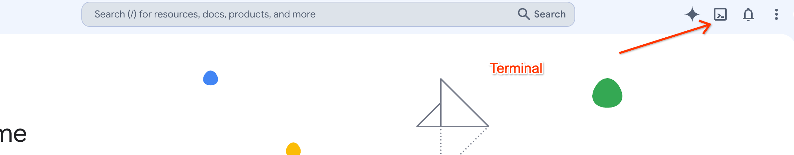

# Gemini Enterprise Eval Studio

## Overview

Gemini Enterprise Eval Studio is an evaluation framework designed to execute
stateless API calls against Gemini Enterprise for E2E evaluation.
It enables customers to run batch evaluations, compare baselines, measure
streaming latency metrics (TTFT, TFUFT, Grounding Latency, Tool Execution
Latency), and define custom metrics using auto-grader rubrics or programmatic
evaluators.

## Motivation

Quality assurance is a major friction point for Gemini Enterprise
implementations. Enterprise customers require secure, client-side tools to
evaluate model performance, accuracy, and streaming latency on custom
collections without relying on externally hosted evaluation platforms that
violate data privacy policies.

## Key Features

-   **Client-Side Stateless Execution**: Direct API communication using end-user
    tokens, ensuring data privacy.
-   **Latency Telemetry Capture**: Calculate and expose Time to First Token
    (TTFT), Time to First User Facing Token (TFUFT), and total latency.
-   **Dual Metric Definition**: Support for both LLM-as-a-Judge rubrics and
    programmatic evaluator modules.

## Data Privacy and Governance

To ensure security and compliance with enterprise data policies, Gemini
Enterprise Eval Studio is designed with a strict client-side, stateless
architecture:

1.  **GCP Tenant Isolation**: The tool operates entirely within the user's
    Google Cloud Platform (GCP) tenant. All computations, evaluation runs, and
    data storage occur within your controlled environment.
2.  **No Google Data Collection**: Google does not collect, store, or have
    access to your customer data, queries, evaluation inputs, or evaluation
    results processed by this tool.
3.  **Governing Agreements**: Any data handling and API calls made by the tool
    are governed solely by the customer's existing agreements with Google Cloud
    for the specific APIs used (e.g., Vertex AI APIs).

## Prerequisites

Before running the application, you will need the following:

1.  **Google Cloud Access Token**: Obtain a temporary access token by running the following command in your terminal (you can open Cloud Shell using the terminal icon on the top right of the Google Cloud Console home page):

    ```sh
    gcloud auth print-access-token
    ```
    *Note: Access tokens are short-lived and will need to be refreshed periodically.*


    


2.  **Gemini API Key**:
    - Navigate to the [Google Cloud Console](https://console.cloud.google.com).
    - Search for and go to **Credentials** (under the *APIs & Services* section).
    - Look for the API key configured for Gemini under the **API Keys** section.
    - You can verify the key's allowed scope by checking the restrictions column to see which APIs can be accessed with that specific API key.

## Running Locally

To run the development server using npm and Angular CLI:

1.  **Install dependencies**:
    ```sh
    npm install
    ```

2.  **Start the development server**:
    ```sh
    npm start
    ```
    or if you have `@angular/cli` installed globally:
    ```sh
    ng serve
    ```
    By default, it listens on port 4200. To serve on a different port, use the
    `--port` option:
    ```sh
    ng serve --port 8080
    ```
